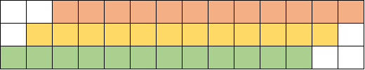
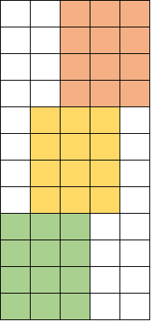
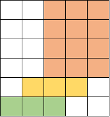

## 3.2

| Instr | -                | delay |
| ----- | ---------------- | ----- |
| LD    | **F2**,0(RX)     | 4     |
| DIVD  | **F8**,**F2**,F0 | 12    |
| MULTD | F2,F6,F2         | 5     |
| LD    | F4,0(Ry)         | 4     |
| ADDD  | F4,F0,F4         | 1     |
| ADDD  | F10,**F8**,F2    | 1     |
| ADDI  | **Rx**,Rx,#8     | 0     |
| ADDI  | Ry,Ry,#8         | 0     |
| SD    | F4,0(Ry)         | 1     |
| SUB   | R20,R4,**Rx**    | 0     |
| BNZ   | R20,Loop         | 1     |

一个 DIVD 的指令需要的 delay 超过了 DIVD 与 ADDD 指令间所需的时间

一个大循环需要 (1+4)+(1+12)+1+1+(1+1)+1+(1+1)=25 个周期

## 3.14

## 三

## 3.19

## 五

<!-- 宽 4 高 25 -->

绿色是取指指令，黄色是分析指令，橙色是执行指令

标量流水线处理机：需要 14 $\Delta t$

超标量处理机：需要 5 $\Delta t$

加速比 $\text{S} = \frac{14}{5} = 2.8$

超长指令字处理机：只是加大了宽度，还是需要 5 $\Delta t$

加速比 $\text{S} = \frac{14}{5} = 2.8$
