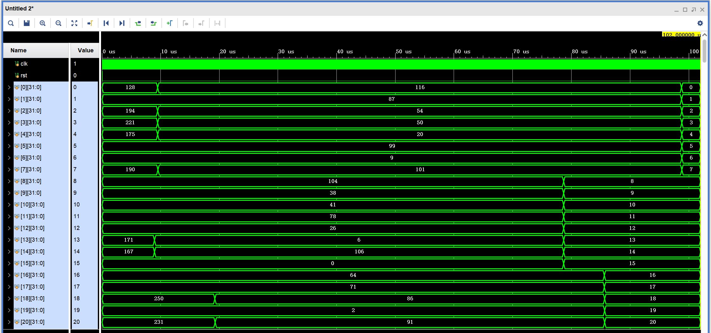
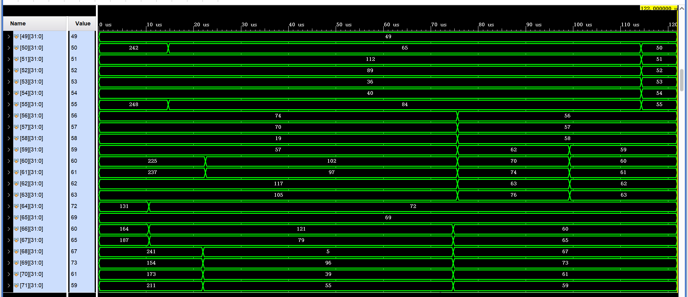

## 实验目标

1. 将 TA 给出的直接相连 Cache 改成组相连 Cache，同时有 LRU 和 FIFO 两种置换策略
2. 权衡 cache size 增大带来的命中率提升收益和存储资源电路面积的开销
3. 权衡选择合适的组相连度（相连度增大 cache size 也会增大，但是冲突 miss 会减低）
4. 体会使用复杂电路实现复杂替换策略带来的收益和简单替换策略的优势

## 实验环境

Vivado 2019，Windows 10，VS Code，Python3

## 实验内容

### 组相连 Cache

#### 命中 Cache

`cache_hit_way` 里只能有一个 1，cache 只会命中一次

```verilog
always @(*) begin
    if (cache_stat==IDLE) begin
        cache_hit = 1'b0;
        for (integer i=0; i<WAY_CNT; i++) begin
            if (valid[set_addr][i] && (cache_tags[set_addr][i] == tag_addr)) begin
                cache_hit_way[i] = 1'b1;
                cache_hit = 1'b1;
            end
            else
                cache_hit_way[i] = 1'b0;
        end
    end
    else
        for (integer i=0; i<WAY_CNT; i++)
            cache_hit_way[i] = 1'b0;
end
```

#### FIFO

TODO:

#### LRU

TODO:

### CPU 中加入 Cache

要修改 WB 段寄存器，把 Cache 替换原本 CPU 中的 DataRam，跑快速排序和矩阵乘法来验证正确性

替换时要理解 Cache 干了啥，在 hazard 中把 miss 信号转换成对所有信号的 stall

要

TODO:

## 实验结果

### Cache 运行结果

#### 阶段一

用 `python generate_cache_tb.py 1000 > cache_tb.sv` 产生测试样例，分别测试 FIFO 和 LRU 的情况，最后 mem 中值符合 `correct read result`

TODO: 图

#### 阶段二

把组相连 Cache 加入 CPU 后，256 个数的快速排序结果如下，可以看到排序成功的结果





16 阶矩阵乘法结果如下，可以看到符合预期

TODO: 图

### Cache 性能测试

实验中保持 `LINE_ADDR_LEN + SET_ADDR_LEN + TAG_ADDR_LEN = 12`，即主存大小为 4096 bytes；Cache 的大小为 WAY_CNT * 2 ^ (SET_ADDR_LEN + LINE_ADDR_LEN)

#### qSort

对 512 个数进行排序

#### 16 阶矩阵乘法

总共的计算量是 2 * 16 ^ 2 = 512，结果一致

## 实验总结
