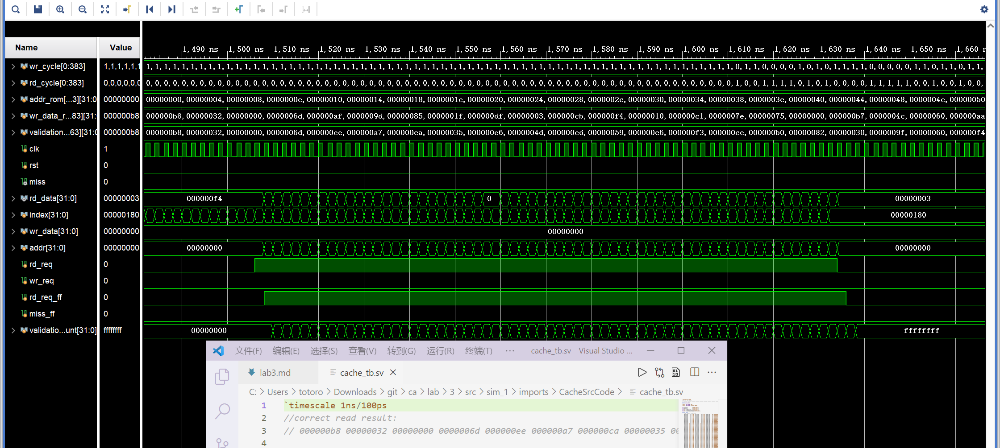

## 实验目标

1. 将 TA 给出的直接相连 Cache 改成组相连 Cache，同时有 LRU 和 FIFO 两种置换策略
2. 权衡 cache size 增大带来的命中率提升收益和存储资源电路面积的开销
3. 权衡选择合适的组相连度（相连度增大 cache size 也会增大，但是冲突 miss 会减低）
4. 体会使用复杂电路实现复杂替换策略带来的收益和简单替换策略的优势

## 实验环境

Vivado 2019，Windows 10，VS Code，Python3

## 实验内容

### 组相连 Cache

#### 命中 Cache

`cache_hit_way` 里只能有一个 1，cache 只会命中一次

```verilog
always @(*) begin
    if (cache_stat==IDLE) begin
        for (integer i = 0; i < WAY_CNT; i++) begin
            if (valid[set_addr][i] && (cache_tags[set_addr][i] == tag_addr))
                cache_hit_way[i] = 1'b1;
            else
                cache_hit_way[i] = 1'b0;
        end
    end
    else
        for (integer i=0; i<WAY_CNT; i++)
            cache_hit_way[i] = 1'b0;
end
```

#### FIFO

开始 FIFO 指针都在开头（也就是下一个换入的位置），每次换入完成之后，这个指针就会模 WAY_LEN 自增，于是先换入的也就先换出，相比 LRU 也很容易实现。

```verilog
reg [WAY_LEN-1:0] count [SET_SIZE];
```

#### LRU

真的 LRU 需要维护时间表，发现 32 bit 的时间戳很容易超过，所以做一个伪 LRU 并不用维护全局使用表，只要维护每个块的访问时间与当前时间的差就好了：如果 hit cache_hit_way 了就清空，如果没 hit 使用表就自增，若到最大值就停止增加；每次选择时间戳最大的、最久未使用的块换出

之后再在 `SWAP_IN_OK` 状态换入新的块来使用被换出的缓存列

```verilog
always @(*) begin
    max_cnt = 0;
    drop = 0;
    for (integer i = 0; i < WAY_CNT; i++)
    begin
        if (lru_cnt[i][set_addr] > max_cnt)
        begin
            max_cnt = lru_cnt[i][set_addr];
            drop = i;
        end
    end
end
```

### CPU 中加入 Cache

要修改 WB 段寄存器，把 Cache 替换原本 CPU 中的 DataRam，跑快速排序和矩阵乘法来验证正确性，同时要在 WB 的 Cache Inst 中加入统计缺失率的功能

```verilog
always @(posedge clk) begin
    if (rst) begin
        miss_count <= 0;
        req_count <= 0;
    end
    else begin
        if (missen)
            miss_count <= miss_count+1;
        if (rd_reqen|wr_reqen)
            req_count <= req_count+1;
    end
end
```

同时要在 hazard 中把 miss 信号转换成对所有信号的 stall（而不是原来的 `DCacheMiss | ICacheMiss`）

```verilog
always@(*) begin
    {StallF, FlushF, StallD, FlushD, StallE, FlushE, StallM, FlushM, StallW, FlushW} <= 0;
    if (CpuRst)
        {FlushF, FlushD, FlushE, FlushM, FlushW} <= 5'b11111;
    else if (miss)
        {StallF, StallD, StallE, StallM, StallW} <= 5'b11111;
    else if (BranchE | JalrE)
        {FlushD, FlushE} <= 2'b11;
    else if (MemToRegE & ((RdE==Rs1D)||(RdE==Rs2D)))
        {StallF, StallD, FlushE} <= 3'b111;
    else if (JalD)
        FlushD <= 1;
end
```

## 实验结果

### Cache 运行结果

#### 阶段一

用 `python generate_cache_tb.py 1000 > cache_tb.sv` 产生测试样例，分别测试 FIFO 和 LRU 的情况，最后 validation 值符合预期



#### 阶段二

把组相连 Cache 加入 CPU 后，256 个数的快速排序结果如下，可以看到排序成功的结果


同时 16 阶矩阵乘法结果也符合预期

### Cache 性能测试

实验中保持 `LINE_ADDR_LEN + SET_ADDR_LEN + TAG_ADDR_LEN = 12`，即主存大小为 4096 bytes；Cache 的大小为 WAY_CNT \* 2 ^ (SET_ADDR_LEN + LINE_ADDR_LEN)

对于 512 个数的快速排序，数据表格如下

LRU

| LINE | SE  | TAG | WAY | LUT 用量 | FF 用量 | Miss Rate |
| ---- | --- | --- | --- | -------- | ------- | --------- |
| 3    | 3   | 6   | 2   | 4.72%    | 4.18%   | 0.0313    |
| 3    | 3   | 6   | 3   | 6.97%    | 5.89%   | 0.0272    |
| 3    | 3   | 6   | 4   | 7.46%    | 7.68%   | 0.0189    |
| 3    | 3   | 6   | 5   | 11.77%   | 9.33%   | 0.0160    |
| 3    | 3   | 6   | 6   | 15.12%   | 11.07%  | 0.0130    |
| 3    | 4   | 5   | 2   | 9.48%    | 7.59%   | 0.0181    |
| 3    | 4   | 5   | 3   | 14.44%   | 11.01%  | 0.0130    |
| 4    | 3   | 5   | 2   | 10.35%   | 8.01%   | 0.0097    |
| 4    | 3   | 5   | 3   | 12.43%   | 11.42%  | 0.0071    |
| 4    | 3   | 5   | 4   | 24.13%   | 14.65%  | 0.0049    |

FIFO

| LINE | SET | TAG | WAY | LUT 用量 | FF 用量 | Miss Rate |
| ---- | --- | --- | --- | -------- | ------- | --------- |
| 3    | 3   | 6   | 2   | 3.31%    | 4.66%   | 0.0320    |
| 3    | 3   | 6   | 3   | 5.52%    | 5.21%   | 0.0236    |
| 3    | 3   | 6   | 4   | 7.22%    | 7.33%   | 0.0189    |
| 3    | 3   | 6   | 5   | 11.49%   | 9.01%   | 0.0151    |
| 3    | 3   | 6   | 6   | 14.77%   | 10.13%  | 0.0128    |
| 3    | 4   | 5   | 2   | 5.16%    | 7.41%   | 0.0184    |
| 3    | 4   | 5   | 3   | 12.88%   | 10.11%  | 0.0129    |
| 4    | 3   | 5   | 2   | 6.37%    | 7.94%   | 0.0099    |
| 4    | 3   | 5   | 3   | 13.34%   | 11.21%  | 0.0063    |
| 4    | 3   | 5   | 4   | 25.12%   | 14.33%  | 0.0046    |

对于 16 阶矩阵乘法，Cache 效果并不好，结果大致相同

## 实验总结

对 512 个数的快速排序，FIFO 相比 LRU 快且更省资源。增大 Cache 容量到一定程度的时候，所有的数据都在 Cache 里面，每次 hit 都能命中，缺失率很低，后面就不做对比了（没啥意义）。当然，很大的 Cache 意味着更多的硬件资源占用

不同的程序对 Cache 的访问规律是不一样的，并没有一个完美的参数和算法可以兼顾硬件资源占用率和各个应用的性能，LRU 尽管看起来比较高级，但是在不少情况下各种意义上都不如 FIFO

上一个实验工具链是 Linux 下的，这个实验是 Win 下的，感觉很奇怪

同时我在生成快速排序、矩阵乘法的测试样例时花了很多时间来移动 InstructionCache.v 和 mem.sv 程序源码，而且我对 PowerShell 并不太熟悉。要是能有一个批量生成测试程序、批量测速的脚本文件就好了。在 Linux 下，我可以使用 bash 和 vivado tcl 的脚本去控制仿真和综合；而 Win 下找不到很好的办法来使用这些工具
