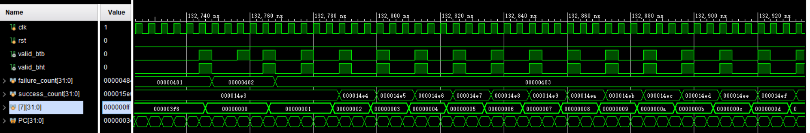
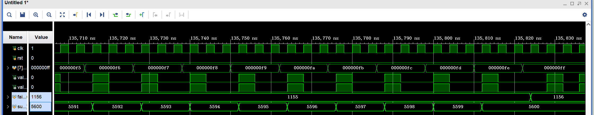
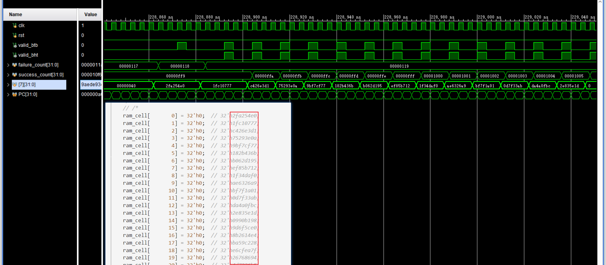
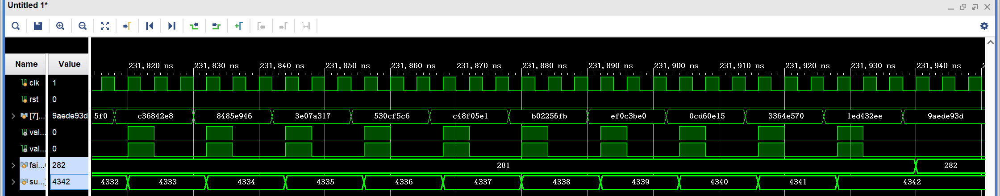

## 实验目标

- 实现 BTB（Branch Target Buffer）
- 实现 BHT（Branch History Table）

## 实验环境

Vivado 2019，Windows 10，VS Code，Python3

## 实验内容

### BTB

Branch Target Buffer 包含了跳转指令的 PC、目标 PC 和有效位

```verilog
assign predicted_valid = (branch_PC[PCF_Map] == PC_F) ? 1'b1 : 1'b0;
assign predicted_PC = (predicted_valid) ? target_PC[PCF_Map] : 32'b0;
```

如果 `PC_F_pos` 对应的 PC 记录与 IF 的相同，那么就预测跳转，输出跳转的值

在 EX 段冲突的时候更新 Buffer 里的记录

```verilog
if (rst) begin
    for (integer i = 0; i < BTB_LEN; i++) begin
        branch_PC[i] <= 32'b0;
        target_PC[i] <= 32'b0;
    end
end
else begin
    if ((br_type_E != `NOBRANCH) & branch_E) begin
        branch_PC[PCE_Map] <= PC_E;
        target_PC[PCE_Map] <= target_E;
    end
end
```

同时，EX 段需要更新，ID 段也需要去传递是否跳转(`branch_E`)、跳转目标(`target_PC`)的信号

在 Predictor 中，如果预测成功，`predicted_valid_IF` 即为 1，NPC 即为预测的跳转到的 PC；若预测失败：

```verilog
assign predicted_EX_error = (branch_E & ~predicted_valid_EX)
        | (~branch_E & predicted_valid_EX)
        | (branch_E & predicted_valid_EX & (target_E != predicted_PC_EX));
```

实际跳转、预测不跳转，实际不跳转、预测跳转，即会出现预测失败，`predicted_EX_error` 为 1，需要在 HarzardUnit 中刷新流水线 `if (predicted_EX_error) {FlushD, FlushE} <= 2'b11;`

之后要在 NPC 中修改：如果跳转且预测，NPC 就取跳转 PC，否则就是 PC_EX

```verilog
if (BranchE & predicted_EX_error) PC_In <= BranchTarget;
else if (~BranchE & predicted_EX_error) PC_In <= PC_EX;
```

### BHT

类似 BTB，加入了 2bit 的 State 和 FSM，但是不需要记录 `target_PC` Buffer

```verilog
if (br_type_E != `NOBRANCH) begin
    branch_PC[PCE_Map] <= PC_E;
    if (branch_E) begin
        case(state[PCE_Map])
            2'b00: state[PCE_Map] <= 2'b01;
            2'b01: state[PCE_Map] <= 2'b10;
            2'b10: state[PCE_Map] <= 2'b11;
            2'b11: state[PCE_Map] <= 2'b11;
        endcase
    end
    else begin
        case(state[PCE_Map])
            2'b00: state[PCE_Map] <= 2'b00;
            2'b01: state[PCE_Map] <= 2'b00;
            2'b10: state[PCE_Map] <= 2'b01;
            2'b11: state[PCE_Map] <= 2'b10;
        endcase
    end
end
```

## 实验结果

使用 BHT 预测快速排序的输出结果，7 号寄存器符合预期行为





使用 BHT 预测矩阵相乘的输出结果，同样 7 号寄存器符合预期行为





## 结果分析

### 分析分支收益和分支代价

若不进行分支预测，分支在 EX 段时总是 flush

因为分支预测成功时不需要 flush，可以减少 2 个周期，而预测失败则无代价

### 统计未使用分支预测和使用分支预测的总周期数

| 样例            | 静态预测 | BHT 预测 |
| --------------- | -------- | -------- |
| BTB             | 511      | 317      |
| BHT             | 537      | 369      |
| QuickSort (256) | 42792    | 33427    |
| MatMul (16)     | 64840    | 57182    |

### 统计分支指令数目、动态分支预测正确次数和错误次数

| 样例            | 分支 | 静态预测-正确/错误 | BHT-正确/错误 |
| --------------- | ---- | ------------------ | ------------- |
| BTB             | 101  | 1/100              | 98/3          |
| BHT             | 110  | 99/11              | 95/15         |
| QuickSort (256) | 6756 | 4923/1833          | 5600/1156     |
| MatMul (16)     | 4368 | 273/4095           | 4089/279      |

### 对比不同策略

加入 BHT 策略效果比静态预测要好

- 对于循环结构来说，静态预测不跳转只能正确预测最后一次执行的情况，对于循环中之前的跳转，总是会预测错误

<!--
- 但是为什么 BTB 在快排上的表现反而比静态预测更差？猜测可能:
  - 汇编中 `PartationFirstStart` 和 `PartationSecondStart` 两段中的分支指令是程序中执行次数较多的，而其中的分支在多次循环的情况下，对「预测不跳转」的策略更有优势。（返回到前面的 label 是由 `jal` 完成的）
  - 而快排递归执行的方式可能也给 BTB 的 1-bit 历史信息带来了一定的干扰。
-->

但是在 `btb` 测试中 BHT 策略比 BTB (1bit) 却略差一些

- `btb` 测试中只有一层循环，BTB 已经足够了，除了首尾两次预测失败以外，其他情况下都是成功的
- 于此同时 BHT 策略要错误两次之后才会变化预测

<!--
- 而 `bht.S` 中的循环是两层的，这时候相比 BTB，BHT 对内循环的猜测准确性提升会很大：BTB 每一个内循环都会有 2 次预测失败，而 BHT 总共只会在最开始失败两次（猜测不跳但实际跳），然后每一个内循环只会预测失败 1 次（内循环结束时不跳但猜测跳）。
-->

而对快排来说，BHT 对执行周期数带来的改善不大：

- 没有实现 jal/jalr 的跳转记录
- 跳转指令只是程序一部分，对程序速度的提高有限
