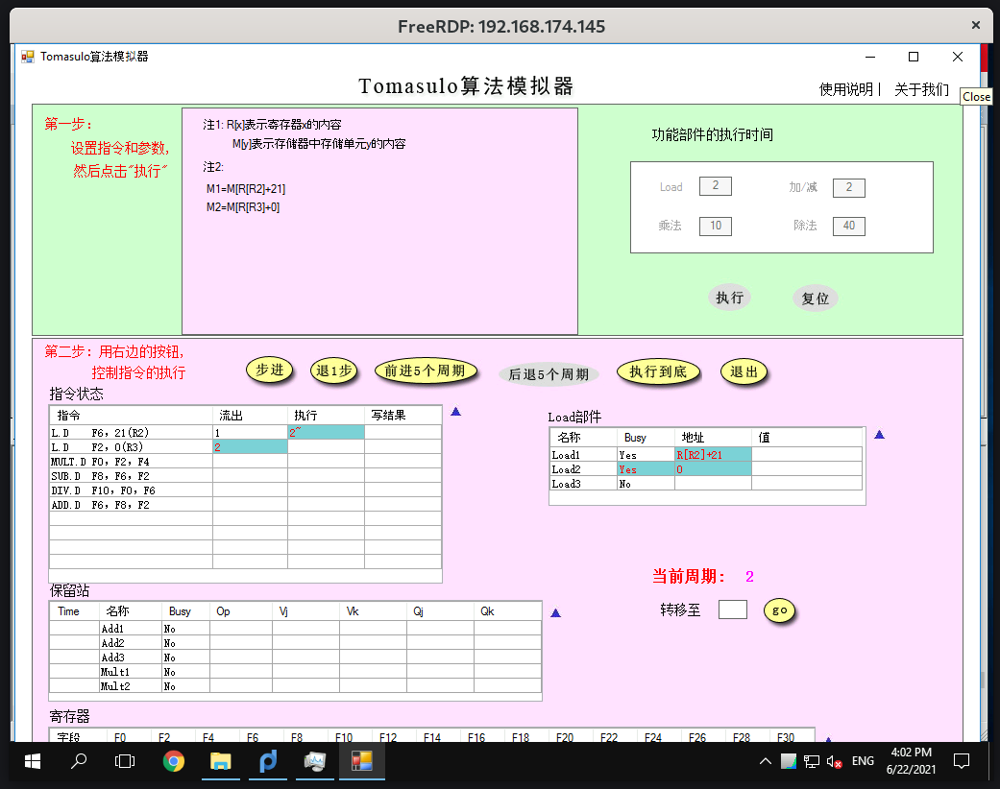
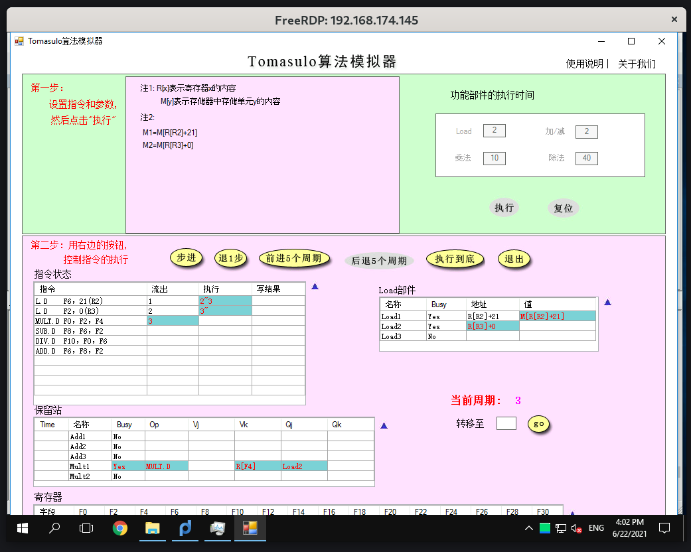
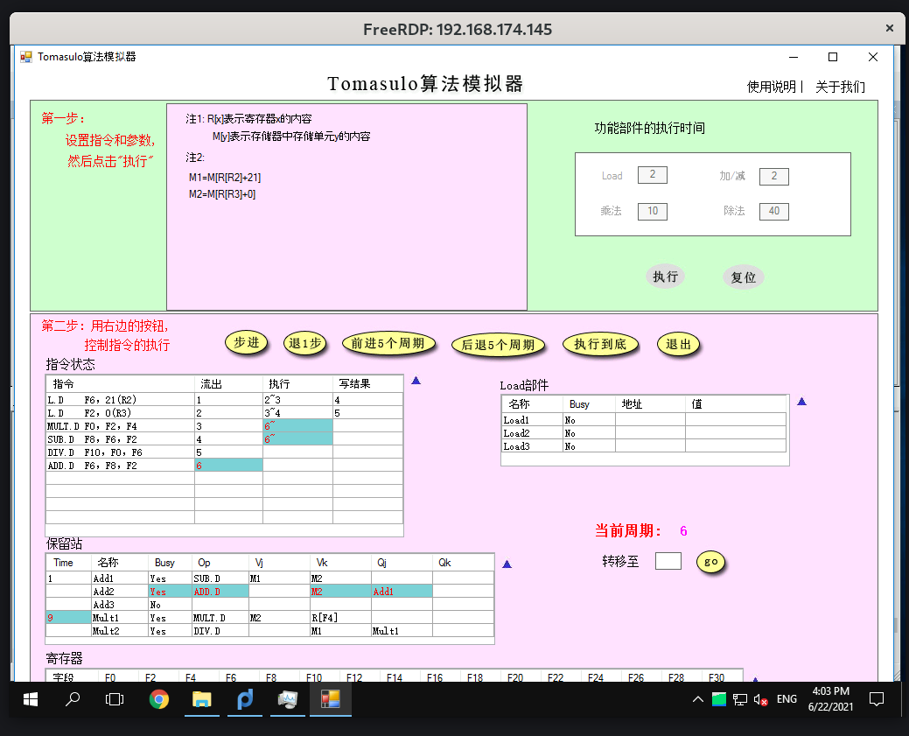
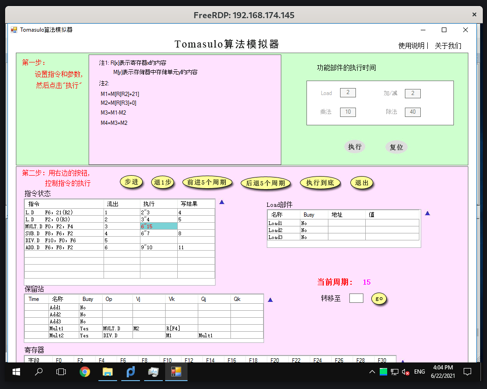
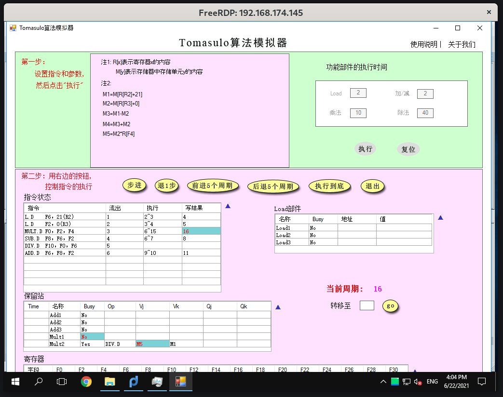
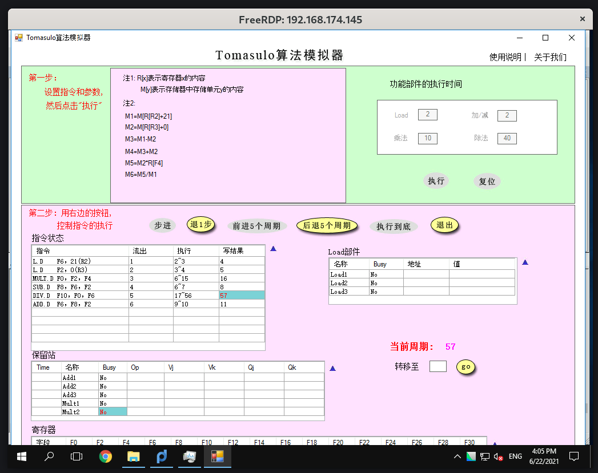
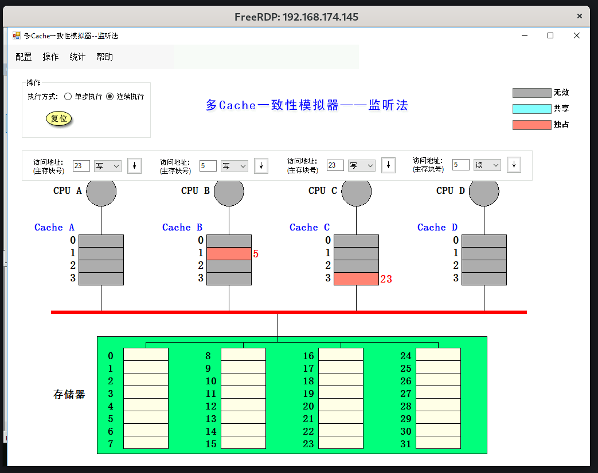
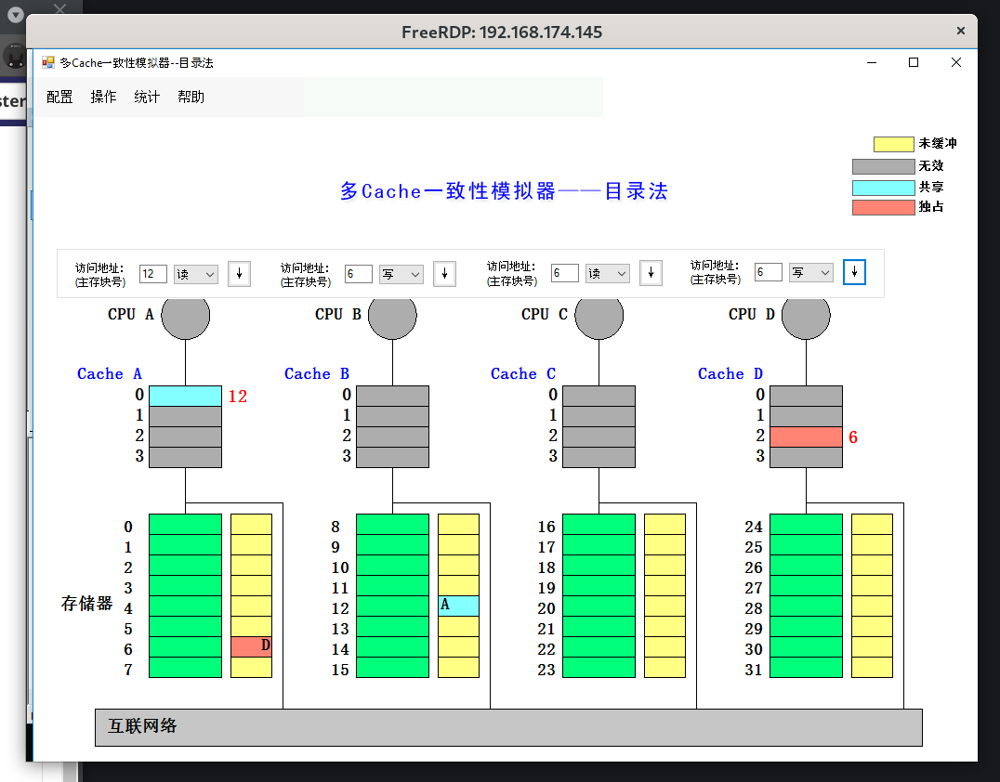

## 实验目标

- 掌握 Tomasulo 算法在指令流出、执行、写结果各阶段对浮点操作指令以及 load 和 store 指令进行什么处理
- 给定被执行代码片段，对于具体某个时钟周期，能够写出保留站、指令状态表以及浮点寄存器状态表内容的变化情况
- 理解监听法和目录法的基本思想

## 实验环境

Arch Linux，Windows 10 (vmware-workstation)，VS Code

## Tomasulo

```assembly
L.D     F6, 21（R2）
L.D     F2, 0（R3）
MUL.D   F0, F2, F4
SUB.D   F8, F6, F2
DIV.D   F10, F0, F6
ADD.D   F6, F8, F2
```

1. 周期 2 截图:

   

   第一条 L.D 指令开始执行，Load1 部件得到了第一条 L.D 指令需要读取的内存地址 21(R2)；第二条 L.D 指令发射，占用 Load2 部件

   周期 3 截图:

   

   第一条 L.D 指令得到了内存中需要读取的值（但是 Load1 结果还没有写回）；Load2 部件得到了第二条 L.D 指令需要读取的内存地址 0(R3)

2. MUL.D 刚开始执行截图：

   

   变动：

   - MUL.D 和 SUB.D 开始执行，保留站的 Time 记录了距离执行完成需要的时间
   - ADD.D 被发射
   - 保留站中 Add2 部件被其占用，读取了 ADD.D 和两运算数（F8 对应 Add1 部件的结果 Qj，F2 对应浮点寄存器中 F2 的值 Vk）

   **由于虚拟机和模拟软件不兼容，无法拉大窗口，寄存器的结果看不到**

3. RAW 相关使得 MUL.D 流出后没有立即执行

   因为 MUL.D 依赖于 F2 寄存器的结果，而 F2 寄存器仍然在 Load2 部件中被读取

   待 Load2 读取完成并且写结果后 MUL.D 才能够执行

4. 15 周期截图:

   

   变化：

   - MULT.D 执行到最后一个周期
   - 保留站中 Mult1 的 Time 清零

   16 周期截图:

   

   变化：

   - MULT.D 写回 M5
   - 保留站中原先占用的 Mult1 释放，Mult2 的 Qj 因为得到了结果，Vj = M5

5. 最后一条指令执行完成为 57 周期，截图：

   

## 多 cache 一致性算法-监听法

替换不将替换无效块计入，把 X[1] 称为 Cache X 的第一块缓存

1. 填表

   | 访问        | 替换 | 写回 | 监听协议的操作与块状态的改变                                    |
   | :---------- | ---- | ---- | --------------------------------------------------------------- |
   | CPU A 读 5  | N    | N    | 读不命中，A[1] 获得 M[5] 值，标记为共享                         |
   | CPU B 读 5  | N    | N    | 读不命中，B[1] 获得 M[5] 值，标记为共享                         |
   | CPU C 读 5  | N    | N    | 读不命中，C[1] 获得 M[5] 值，标记为共享                         |
   | CPU B 写 5  | N    | N    | 作废，B[1] 标记为独占，A[1]、C[1] 作废，B[1] 被写入             |
   | CPU D 读 5  | N    | Y    | 读不命中，B[1] 写回，标记为共享，D[1] 获得 M[5] 值，标记为共享  |
   | CPU B 写 21 | Y    | N    | 写不命中，B[1] 被获得的 M[21] 替换，B[1] 标记为独占，被写入     |
   | CPU A 写 23 | N    | N    | 写不命中，A[3] 获得 M[23] 值，A[3] 标记为独占，被写入           |
   | CPU C 写 23 | N    | Y    | 写不命中，A[3] 写回作废，C[3] 获得 M[23] 值，标记为独占，被写入 |
   | CPU B 读 29 | Y    | Y    | 读不命中，B[1] 写回作废，B[1] 获得 M[29] 值，标记为共享         |
   | CPU B 写 5  | Y    | N    | 写不命中，B[1] 被替换为获得 M[5] 值，标记为独占，D[1] 失效      |

2. 截图

   

## 多 cache 一致性算法-目录法

1. 填表

   | 访问        | 监听协议的操作与块状态的改变                                                                                                                           |
   | :---------- | ------------------------------------------------------------------------------------------------------------------------------------------------------ |
   | CPU A 读 6  | 读不命中消息到 A，A[2] 从 A 得到 M[6]，A[2] 与存储器均标记为共享，M[6] 共享集合 {A}                                                                    |
   | CPU B 读 6  | 读不命中消息到 A，B[2] 从 A 得到 M[6]，A[2]、B[2] 标记为共享，M[6] 共享集合 {A, B}                                                                     |
   | CPU D 读 6  | 读不命中消息到 A，D[2] 从 A 得到 M[6]，对应 Cache 块标记为共享，M[6] 共享集合 {A, B, D}                                                                |
   | CPU B 写 6  | 写命中消息到 A，A[2]、D[2] 作废，共享集合 {B}，B[2] 与 M[6] 均标记为独占，写入                                                                         |
   | CPU C 读 6  | 读不命中消息到 A，A 向 B 读取，B 传送修改后的 M[6] 到 A，状态改为共享，之后 C[2] 从 A 得到 M[6]，B[2]、C[2]、M[6] 标记为共享，共享集合 {B, C}          |
   | CPU D 写 20 | 写不命中消息到 C，C 向 D 传送 M[20]，而后 D[0] 标记为独占，写入，M[20] 也标记为独占，共享集合 {D}                                                      |
   | CPU A 写 20 | 写不命中消息到 C，C 向 D 发送读取并作废消息，D 传送修改后的 M[20] 到 C，并作废 D[0]，而后 C 将内容传输到 A[0]，其和 M[20] 均为独占，写入，共享集合 {A} |
   | CPU D 写 6  | 写不命中消息到 A，A 向 B、C 发送作废消息，B[2]、C[2] 作废，而后将 M[6] 传输给 D[2]，M[6] 和 D[2] 标记为独占，写入，共享集合 {D}                        |
   | CPU A 读 12 | 写回消息到 C，A[0] 中被修改的 M[20] 写回，共享集合空，读不命中消息到 B，B 将 M[12] 给 A[0]，均标记为共享，共享集合 {A}                                 |

2. 截图:

   

## 综合问答

1. 目录法和监听法分别是集中式和基于总线，两者优劣是什么？

   - 监听法不需要跟踪缓存状态，可以降低成本，但是监听法的每次缓存缺失都需要与所有的缓存通信，总线带宽要求较大
   - 目录法通过存储状态，减少了一致性时的通信流量，降低了对带宽的要求，但是存储也需要成本，且其实现复杂

2. Tomasulo 算法相比 Score Board 算法有什么异同？

   - Score Board 用 stall 的方式处理相关；Tomasulo 是用寄存器重命名的方法
   - Tomasulo 可以拓展处理推测，减小控制相关的影响
   - Score Board 是集中式的，指令状态等都在记分牌中；Tomasulo 是分布式的，控制和缓存分布在各个部件中

3. Tomasulo 算法是如何解决结构、RAW、WAR 和 WAW 相关的？
   - 结构相关：出现结构冲突，即保留站忙时不发射
   - RAW：在操作数未准备好时，推迟指令执行
   - WAR：寄存器重命名，指令中的寄存器在保留站中用寄存器值或指向保留站的指针代替
   - WAW：寄存器重命名
